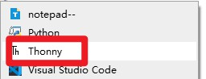

### 1, Product picture

### 2, Product version number

|      | Hardware | Software | Remark |
| ---- | -------- | -------- | ------ |
| 1    | V3.0     | V3.0     | latest |

### 3, product information

- Model: 7.0 inch -CrowPanel ESP32 display
- Main Processor: ESP32-S3-WROOM-1-N4R8
- Resolution: 800*480
- Flash: 4MB
- PSRAM:8MB
- Touch Type: Capacitive Touch Screen
- Display Type: TN Panel
- Screen: TFT-LCD Screen
- Display driver: EK9716BD3 & EK73002ACGB
- External power supply: DC5V-2A
- Interface: 2*UART0,2*GPIO,2*I2C,1*Battery
- Button: BOOT Button and Reset Button
- Active Area: 153.84*85.63mm(W*H)
- Working Temperature: -20℃～70℃
- Storage Temperature: -30℃～80℃

### 4, Use the driver module

| Name | dependency library |
| ---- | ------------------ |
| LVGL | lvgl/lvgl@8.3.3    |

### 5,Quick Start

##### Arduino IDE starts

1.Download the library files used by this product to the 'libraries' folder.

C:\Users\Documents\Arduino\libraries\

2.Open the Arduino IDE

3.Open the code configuration environment and burn it

##### ESP-IDF starts

1.Right-click on an empty space in the project folder and select "Open with VS Code" to open the project.

2.In the IDF plug-in, select the port, then compile and flash

##### PlatformIO starts

1.Right-click on an empty space in the project folder and select "Open with VS Code" to open the project.

2.In the PlatformIO plug-in, select the port, then compile and flash

##### Micropython starts

1,Right-click on an empty space in the project folder and select "Thonny" to open the project.

2,In thonny software, select the master and port, then run the program

### 6,Folder structure.

|--3D file： Contains 3D model files (.stp) for the hardware. These files can be used for visualization, enclosure design, or integration into CAD software.

|--Datasheet: Includes datasheets for components used in the project, providing detailed specifications, electrical characteristics, and pin configurations.

|--Eagle_SCH&PCB: Contains **Eagle CAD** schematic (`.sch`) and PCB layout (`.brd`) files. These are used for circuit design and PCB manufacturing.

|--example: Provides example code and projects to demonstrate how to use the hardware and libraries. These examples help users get started quickly.

|--factory_firmware: Stores pre-compiled factory firmware that can be directly flashed onto the device. This ensures the device runs the default functionality.

|--factory_sourcecode: Contains the source code for the factory firmware, allowing users to modify and rebuild the firmware as needed.

### 7,Pin definition

class LGFX : public lgfx::LGFX_Device
{
public:

  lgfx::Bus_RGB     _bus_instance;
  lgfx::Panel_RGB   _panel_instance;

  LGFX(void)
  {

    {
      auto cfg = _bus_instance.config();
      cfg.panel = &_panel_instance;
    
      cfg.pin_d0  = GPIO_NUM_15; // B0
      cfg.pin_d1  = GPIO_NUM_7;  // B1
      cfg.pin_d2  = GPIO_NUM_6;  // B2
      cfg.pin_d3  = GPIO_NUM_5;  // B3
      cfg.pin_d4  = GPIO_NUM_4;  // B4
    
      cfg.pin_d5  = GPIO_NUM_9;  // G0
      cfg.pin_d6  = GPIO_NUM_46; // G1
      cfg.pin_d7  = GPIO_NUM_3;  // G2
      cfg.pin_d8  = GPIO_NUM_8;  // G3
      cfg.pin_d9  = GPIO_NUM_16; // G4
      cfg.pin_d10 = GPIO_NUM_1;  // G5
    
      cfg.pin_d11 = GPIO_NUM_14; // R0
      cfg.pin_d12 = GPIO_NUM_21; // R1
      cfg.pin_d13 = GPIO_NUM_47; // R2
      cfg.pin_d14 = GPIO_NUM_48; // R3
      cfg.pin_d15 = GPIO_NUM_45; // R4
    
      cfg.pin_henable = GPIO_NUM_41;
      cfg.pin_vsync   = GPIO_NUM_40;
      cfg.pin_hsync   = GPIO_NUM_39;
      cfg.pin_pclk    = GPIO_NUM_0;
      cfg.freq_write  = 15000000;
    
      cfg.hsync_polarity    = 0;
      cfg.hsync_front_porch = 40;
      cfg.hsync_pulse_width = 48;
      cfg.hsync_back_porch  = 40;
    
      cfg.vsync_polarity    = 0;
      cfg.vsync_front_porch = 1;
      cfg.vsync_pulse_width = 31;
      cfg.vsync_back_porch  = 13;
    
      cfg.pclk_active_neg   = 1;
      cfg.de_idle_high      = 0;
      cfg.pclk_idle_high    = 0;
    
      _bus_instance.config(cfg);
    }
            {
      auto cfg = _panel_instance.config();
      cfg.memory_width  = 800;
      cfg.memory_height = 480;
      cfg.panel_width  = 800;
      cfg.panel_height = 480;
      cfg.offset_x = 0;
      cfg.offset_y = 0;
      _panel_instance.config(cfg);
    }
    _panel_instance.setBus(&_bus_instance);
    setPanel(&_panel_instance);

  }
};

 #define TOUCH_GT911_SCL 20//20
 #define TOUCH_GT911_SDA 19//19
